# KDTree Baseline 实验汇总

完成 run 数：312

## 关键导出

- `runs_flat.csv`：每个 run 的扁平化指标表
- `bbox_depth_all.csv`：按深度汇总的 bbox 统计
- `group_size_hist_all.csv`：每个 run 的组大小直方图

## 图表

### chunk_G_t.png

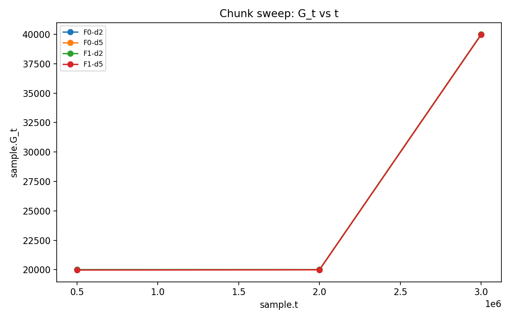

### chunk_U_t.png

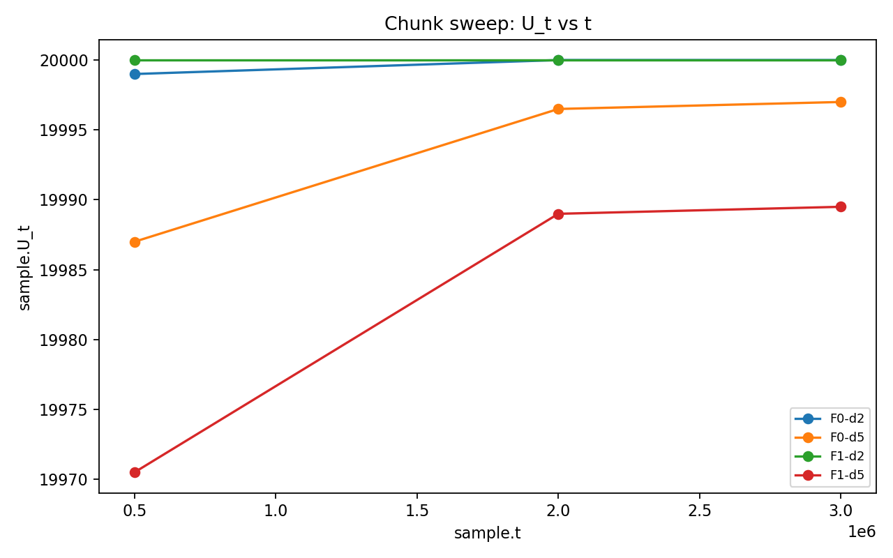

### chunk_avg_group_exec.png

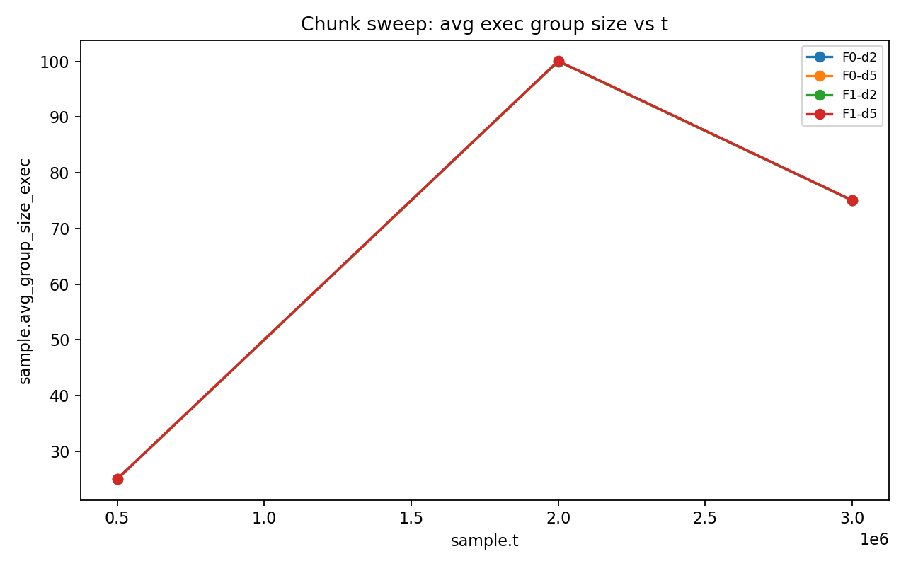

### density_P_count_mean.png

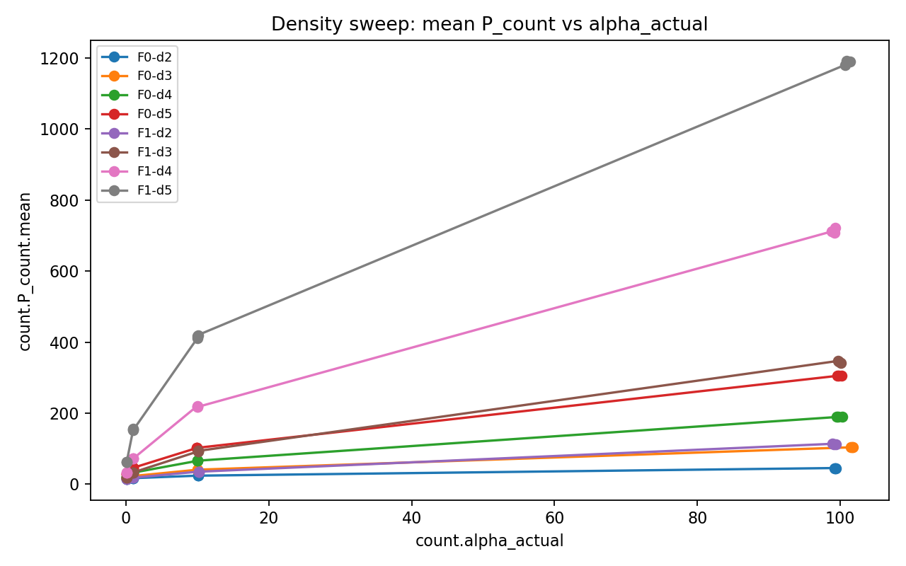

### density_T_count.png

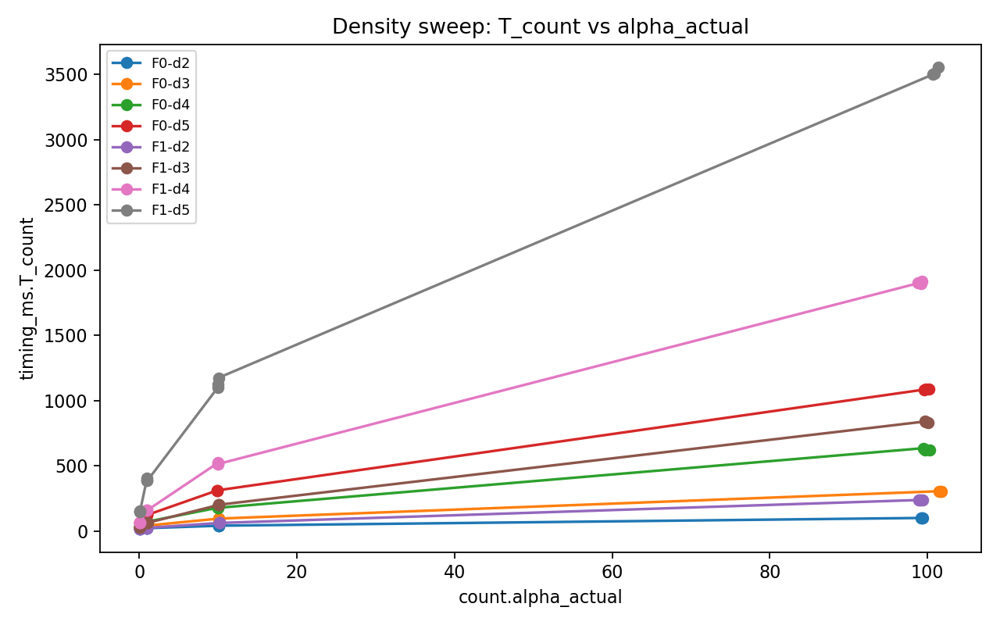

### density_rho_weighted.png

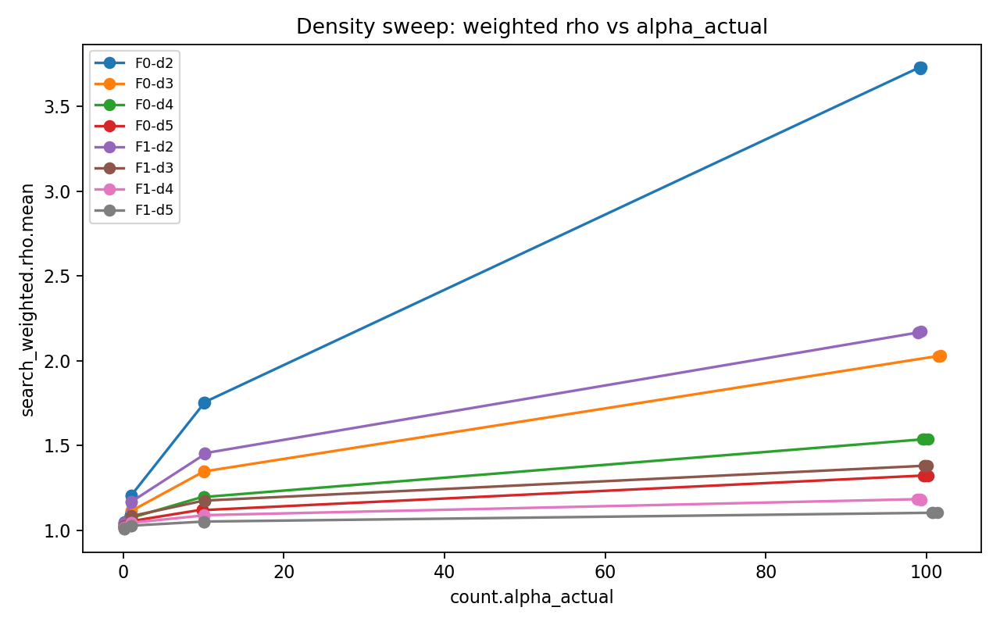

### density_sigma_weighted.png

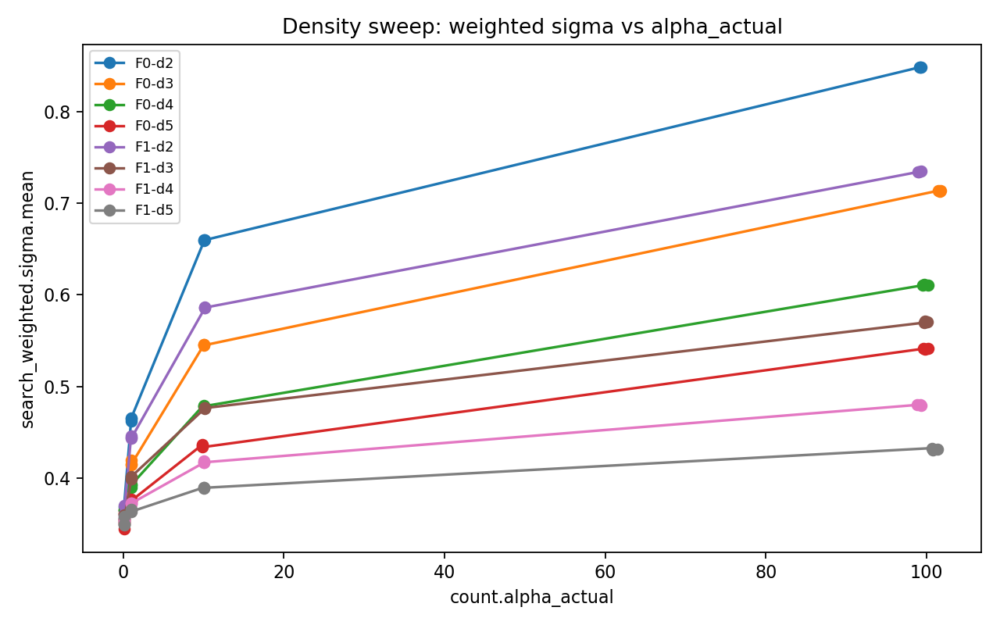

### input_size_T_build.png

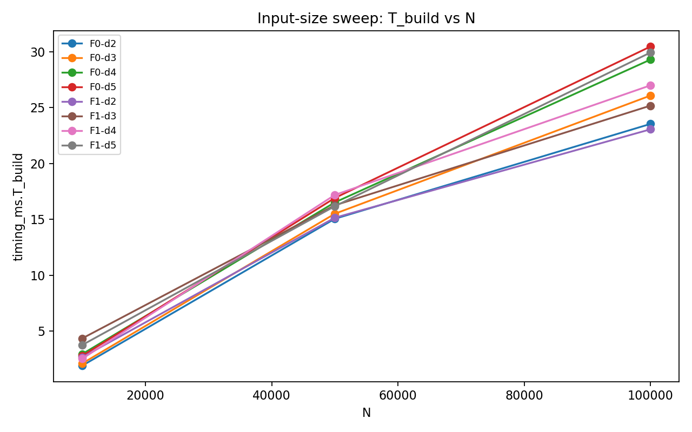

### input_size_T_count.png

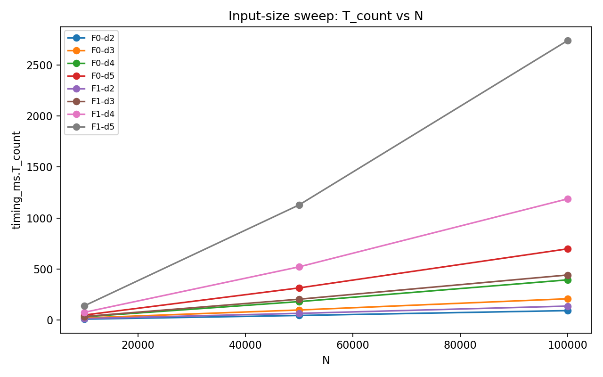

### input_size_tree_height.png

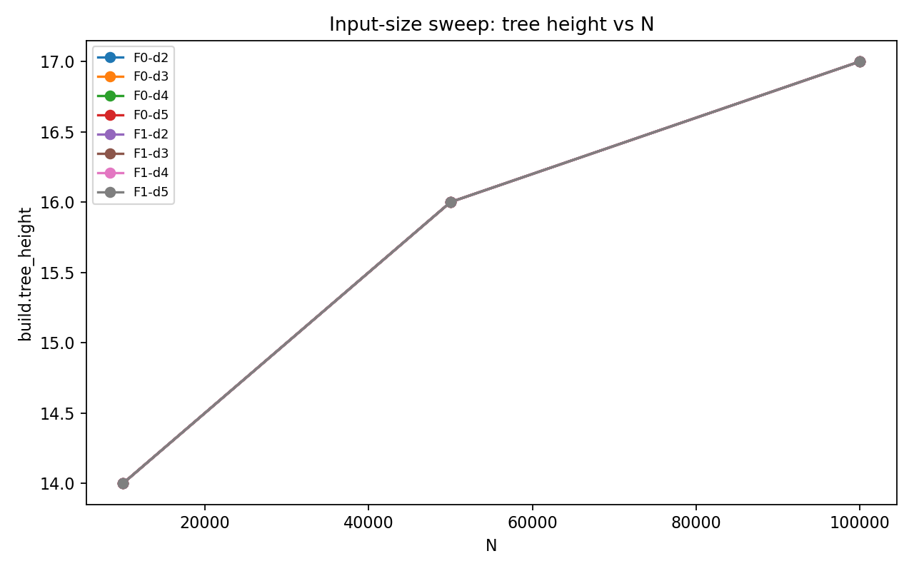

### sample_size_G_t.png

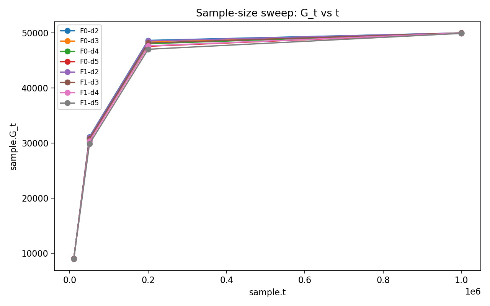

### sample_size_U_t.png

### sample_size_avg_group_exec.png

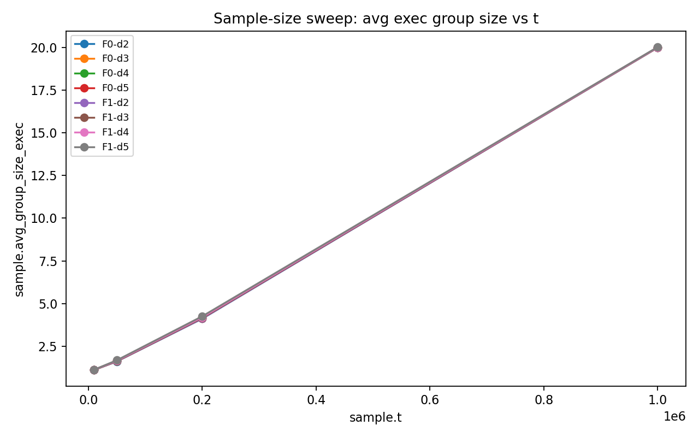

### sample_size_throughput.png

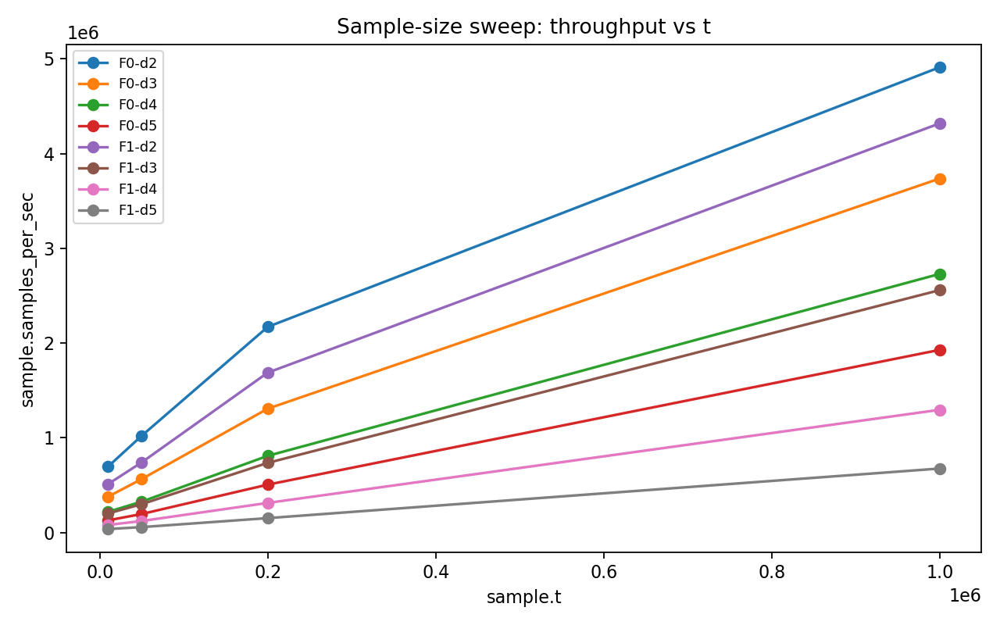
